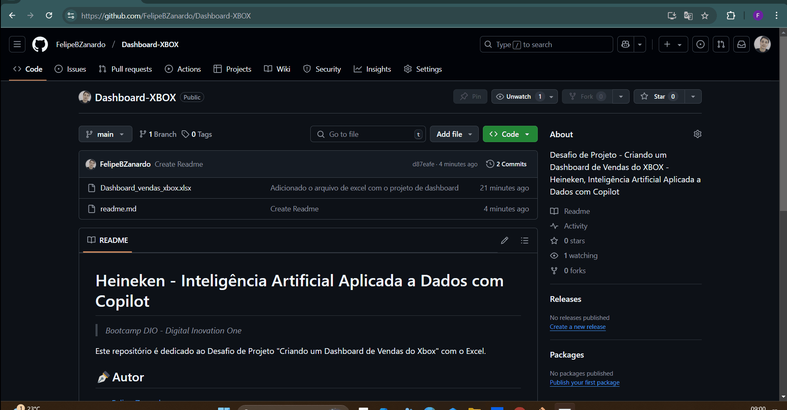

# Heineken - Inteligência Artificial Aplicada a Dados com Copilot
> *Bootcamp DIO - Digital Inovation One*

Este repositório é dedicado ao Desafio de Projeto "Criando um Dashboard de Vendas do Xbox" com o Excel.

## ✒️Autor 
- [Felipe Zanardo](https://github.com/FelipeBZanardo)

## 📝Objetivo

Utilizando a base de dados fornecida [base.xlsx](https://hermes.dio.me/files/assets/805d54f9-6d53-4246-bed7-4aa2da615923.xlsx), criar um Dashboard de Vendas do Xbox com a ferramenta Excel.
Seguir o passo a passo do instrutor [Felipe Aguiar](https://github.com/felipeAguiarCode) para a construção do painel visual.
Os dados analisados respondem algumas perguntas de negócio, que por sua vez, serve de base para a construção de gráficos e Big Numbers que compõem o Dashboard.

## ⁉️Perguntas de Negócios

- Pergunta de Negócios 1: Qual faturamento Total de vendas de planos anuais (contendo todas as assinaturas agregadas)?
- Pergunta de Negócios 2: Qual faturamento Total de vendas de planos anuais, separado por auto renovação ou não é por auto renovação
- Pergunta de Negócios 3: Total de Vendas de Assinaturas de EA Play
- Pergunta de Negócios 4: Total de assinaturas do Minexaft Season Pass
- Pergunta de Negócios 5: Qual o total de descontos oferecidos pelos cupons?
- Pergunta de Negócios 6: Qual a distribuição das datas de início das assinaturas ao longo do ano?

## ⚙️Requisitos

- Excel

## 📺 Demonstração

  

